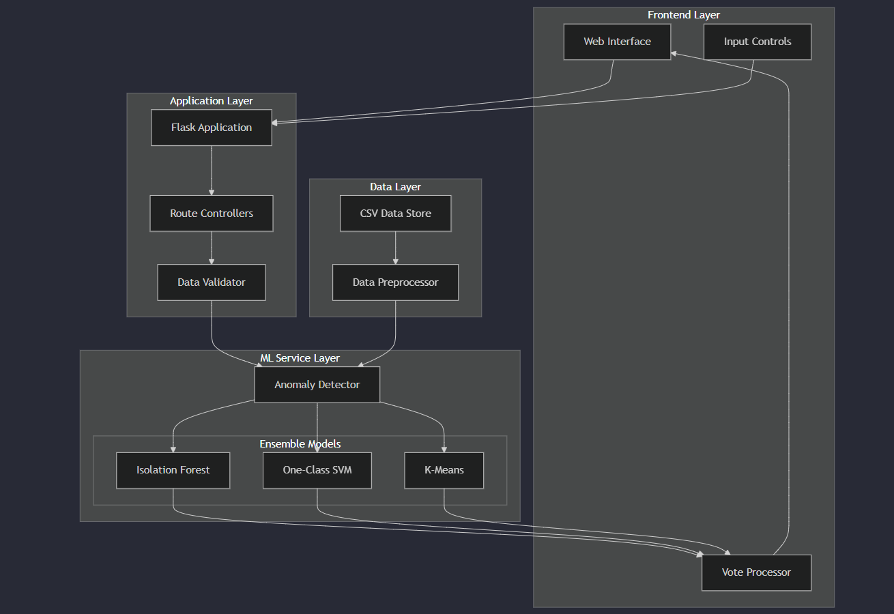

# Aircraft Anomaly Detection System

An intelligent web application that leverages machine learning models to detect anomalies in aircraft attributes. The system combines multiple anomaly detection algorithms including Isolation Forest, One-Class SVM, and K-Means clustering to provide robust anomaly detection capabilities.


## Features

- **Multi-Model Anomaly Detection**: Combines predictions from multiple ML models for robust anomaly detection
- **Interactive Visualization**: Dynamic scatter plots for visualizing anomalies across different aircraft attributes
- **Real-time Aircraft Checking**: Input custom aircraft parameters to check for anomalous behavior
- **Flexible Attribute Selection**: Choose any two attributes for visualization and analysis
- **Ensemble Decision Making**: Weighted voting system across multiple models for reliable anomaly detection

## System Architecture

The application follows a modular architecture with clear separation of concerns:



### Project Structure
```
aircraft-anomaly-detection/
├── src/
│   ├── main.py                 # Flask application entry point
│   ├── models/
│   │   └── anomaly_detector.py # Anomaly detection implementation
│   ├── utils/
│   │   └── data_processor.py   # Data preprocessing utilities
│   └── config/
│       └── config.py           # Configuration parameters
├── templates/
│   ├── index.html             # Main visualization page
│   └── check_plane.html       # Aircraft checking interface
├── static/
│   ├── css/
│   │   └── style.css          # Custom styling
│   └── js/
│       └── plots.js           # Interactive plotting scripts
├── data/
│   └── Aircraft_data.csv      # Training dataset
├── tests/
│   ├── test_models.py
│   └── test_api.py
├── requirements.txt
└── README.md
```

## Prerequisites

### System Requirements
- Python 3.6 or higher
- 4GB RAM minimum
- 2GB free disk space

### Required Python Packages
```bash
pip install -r requirements.txt
```

Key dependencies:
- Flask==2.0.1
- pandas==1.3.0
- scikit-learn==0.24.2
- matplotlib==3.4.2
- numpy==1.21.0

## Installation

1. Clone the repository:
```bash
git clone https://github.com/your-username/aircraft-anomaly-detection.git
cd aircraft-anomaly-detection
```

2. Create and activate a virtual environment:
```bash
python -m venv venv
source venv/bin/activate  # On Windows: venv\Scripts\activate
```

3. Install dependencies:
```bash
pip install -r requirements.txt
```

4. Configure the application:
```bash
cp config/config.example.py config/config.py
# Edit config.py with your settings
```

5. Run the application:
```bash
python src/main.py
```

## Usage Guide

### 1. Visualizing Anomalies

1. Navigate to `http://localhost:5000`
2. Select attributes for X and Y axes
3. Click "Generate Plot" to visualize anomalies
4. Anomalous points will be highlighted in the scatter plot

### 2. Checking Individual Aircraft

1. Go to "Check Your Plane" section
2. Input aircraft attributes
3. Click "Check" to get the anomaly status
4. Review the detailed analysis report

## API Documentation

### REST Endpoints

#### GET /
- Returns the main visualization interface
- Query Parameters: None
- Response: HTML page

#### POST /check_plane
- Checks if an aircraft is anomalous
- Request Body: JSON with aircraft attributes
- Response: JSON with anomaly status and confidence score

## Development

### Running Tests
```bash
pytest tests/
```

### Code Style
We follow PEP 8 guidelines. Run linter:
```bash
flake8 src/
```

### Contributing
1. Fork the repository
2. Create a feature branch (`git checkout -b feature/AmazingFeature`)
3. Commit changes (`git commit -m 'Add AmazingFeature'`)
4. Push to branch (`git push origin feature/AmazingFeature`)
5. Open a Pull Request

## Performance Optimization

- Use `debug=False` in production
- Enable caching for frequent queries
- Optimize database queries
- Use asynchronous processing for long-running tasks

## Troubleshooting

Common issues and solutions:
1. **ModuleNotFoundError**: Ensure all dependencies are installed
2. **Port Already in Use**: Change the port in config.py
3. **Memory Issues**: Increase system RAM or reduce batch size

## License

Distributed under the MIT License. See `LICENSE` for more information.

## Acknowledgments

- scikit-learn team for machine learning implementations
- Flask framework developers
- Aircraft safety research community